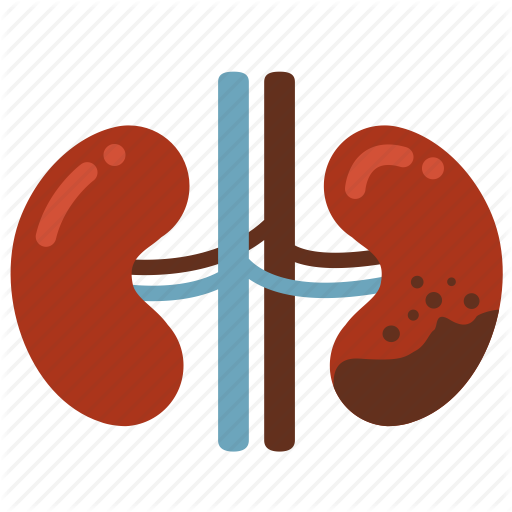

# Chronic Kidney Disease
Classification of chronic kidney disease

Table of Contents
1. [ Introduction. ](#intro)
2. [ The Data. ](#data)
3. [ Questions. ](#questions)
4. [ Findings. ](#findings)
5. [ Conclusion. ](#conclusion)
6. [ Implementation. ](#implem)
7. [ Instructions. ](#instruct)
8. [ Licensing, Authors, Acknowledgements. ](#ack)

Using a dataset from Kaggle predictions have been made on patients' kidney data to determine whether there are any clear indications of chronic kidney disease.

## 1. Introduction
A few years ago I gave birth to a healthy little girl after what was mostly a straight forward pregnancy. During the last couple months I was placed in the high risk pregnancy group due to raised blood pressure (gestational hypertension); my only visible symptom were my swollen feet. Ten days after I gave birth my blood pressure rose even higher and it was determined to be preeclampsia. For a small proportion of women, the outcome can be a lot more dire. If left untreated, it can lead to organ failure and can be life-threatening for both mother and baby.

Someone I know has kidney failure and is suffering the affects many years later as a result of untreated preeclampsia. An induced coma, failed kidney transplant, dialysis ... I'd like to find out more about this condition that I thankfully avoided.

The kidney dataset I use in my investigation is from Kaggle, and will be used to determine whether there are any clear indications of chronic kidney disease which my friend is enduring. Can patients be classified  as having chronic kidney disease based on features in it. We will try to use this data to create a model which tries predict if a patient has this disease or not. We will use ... algorithms.

The expectation is that this project could be used to benefit people affected by chronic kidney disease by quickly identifying it in it's early stages.

## 2. The Data
The data has been prepared into train and test files and a machine learning pipeline has been used to build a supervised learning model.

The columns and their descriptions are as follows:

age - age: Age(numerical) - in years
bp - blood pressure: Blood Pressure(numerical) - in mm/Hg
sg - specific gravity Specific Gravity(nominal) - (1.005,1.010,1.015,1.020,1.025)
al - albumin Albumin(nominal) - (0,1,2,3,4,5)
su - sugar Sugar(nominal) - (0,1,2,3,4,5)
rbc - red blood cells Red Blood Cells(nominal) - (normal,abnormal)
pc - pus cell Pus Cell (nominal) - (normal,abnormal)
pcc - pus cell clumps Pus Cell clumps(nominal) - (present,notpresent)
ba - bacteria Bacteria(nominal) - (present,notpresent)
bgr - blood glucose random Blood Glucose Random(numerical) - in mgs/dl
bu - blood urea Blood Urea(numerical) - in mgs/dl
sc - serum creatinine Serum Creatinine(numerical) - in mgs/dl
sod - sodium Sodium(numerical) - in mEq/L
pot - potassium Potassium(numerical) - in mEq/L
hemo - hemoglobin Hemoglobin(numerical) - in gms
pcv - packed cell volume Packed Cell Volume(numerical)
wc - white blood cell count White Blood Cell Count(numerical) - in cells/cumm
rc - red blood cell count Red Blood Cell Count(numerical) - in millions/cmm
htn - hypertension Hypertension(nominal) - (yes,no)
dm - diabetes mellitus Diabetes Mellitus(nominal) - (yes,no)
cad - coronary artery disease Coronary Artery Disease(nominal) - (yes,no)
appet - appetite Appetite(nominal) - (good,poor)
pe - pedal edema Pedal Edema(nominal) - (yes,no)
ane - anemia Anemia(nominal) - (yes,no)
Our target: class - Class (nominal)- class - (ckd,notckd)

## 3. Questions
Can chronic kidney disease be identified in it's early stages?

## 4. Findings
### Building the model
Pipelines are used to take in the data from the database, put it through a tokenizer, tfidf transformer, two custom transformers which find messages related to death and children, and finally through a random forest classifier – to produce a trained model, which can then be used for prediction.

Using Scikit-learn’s FeatureUnion class makes it easy to write complex pipelines. Here smaller pieces (transformers) have been built and then combined horizontally.

Using Pipelines and FeatureUnions helped in the orgainzation of the code for readability, reusability and easier experimentation.

### What happened after adding these features?
Accuracy is low after applying a random forest classifier to the data. An SGD classifier was also used, but since the train-test split produced some labels with just zeros there was no way of moving forward with this model.
Other classifers which support multi-labels will be tried in future versions of the app.

* sklearn.tree.DecisionTreeClassifier
* sklearn.tree.ExtraTreeClassifier
* sklearn.ensemble.ExtraTreesClassifier
* sklearn.neighbors.KNeighborsClassifier
* sklearn.neural_network.MLPClassifier
* sklearn.neighbors.RadiusNeighborsClassifier
* sklearn.ensemble.RandomForestClassifier
* sklearn.linear_model.RidgeClassifierCV

Describe photo

Describe photo

## 5. Conclusion
Accuracy is .... after applying a combination of parameters using a pipeline.
By adding in more features, and doing hyperparameter tuning, the accuracy ....

This may be expected due to the number of rows versus variables, though other classifiers are worth trying to increase the current accuracy.

------------------------------------------------------------------------------------------------------------------

## 6. Implementation
### Technical Information

##### Pip Install
1. sklearn
1. nltk
1. plotly
1. flask
1. joblib

##### Libraries:
1. sys
1. re
1. numpy
1. pandas
1. pickle
1. sqlalchemy
1. nltk
1. sklearn
1. plotly
1. flask
1. joblib
1. json
1. sqlalchemy
1. sqlite3

### File Descriptions
1. process_data.py: cleans the data before adding it to a database
1. train_classifier.py: builds and evaluates a model for the data in the database and saves a dataframe to a pickle file, where the pickle library is used for serializing and deserializing objects.
1. transformation.py: creates the custom transformers to find ....
1. run.py: runs the app in a web browser untilizing the database and model.
1. master.html: main html page for layout and styling of the web app.
1. go.html: outputs the model results to the web app.

1. kidney_disease_train.csv: messages created by thepublic in the native language, converted into english.
1. kidney_disease_test.csv: categories into which messages fall; water, medical, etc.
1. kidney_failure.jpg: a drawing of a funtioning kidney and a failed kidney.

## 7. Instructions:

### How To Interact With The Project
Install the files into a folder on your computer

1. Run the following commands in the project's root directory to set up your database and model.

    - To run ETL pipeline that cleans data and stores in database
        `python data/.....py data/.....csv data/.....csv data/....db`
    - To run ML pipeline that trains classifier and saves
        `python models/train_classifier.py data/.....db models/classifier.pkl`

2. Run the following command to view the web app.
    `python app/run.py`

3. Go to http://0.0.0.0:3001/ to run the web app.

## 8. Licensing, Authors, Acknowledgements

The data files were retrieved from [Kaggle]https://www.kaggle.com/colearninglounge/chronic-kidney-disease, via https://archive.ics.uci.edu/ml/datasets/Chronic_Kidney_Disease.

Thanks to [Udacity]https://www.udacity.com/ for supporting this project.
