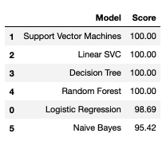

# Chronic Kidney Disease
Classification of chronic kidney disease

Table of Contents
1. [ Project Overview. ](#intro)
2. [ Problem Statement. ](#data)
3. [ Metrics. ](#metrics)
4. [ Data Exploration and visualization. ](#viz)
5. [ Methodology. ](#methodology)
6. [ Results. ](#results)
7. [ Conclusion. ](#conclusion)
8. [ Licensing, Authors, Acknowledgements. ](#ack)


<a name="intro"></a>
## 1. Project Overview
This article is for my Udacity Data Science Nanodegree capstone project and uses a dataset on chronic kidney disease from [Kaggle]https://www.kaggle.com/colearninglounge/chronic-kidney-disease. Predictions have been made on patients' kidney data to determine whether there are any clear indications of chronic kidney disease.


<a name="data"></a>
## 2. Problem Statement
A few years ago during pregnancy I was placed in the high risk group due to raised blood pressure (gestational hypertension). Ten days after birth my blood pressure rose even higher and it was determined to be preeclampsia; pronounced [pree·uh·klamp·see·uh]. Left untreated preeclampsia can lead to organ failure; in particular to the liver and kidneys.

This data science project will be to investigate kidney data (described in the Kaggle link above) to predict whether or not a patient has chronic kidney disease. The expectation is that the results of this project could be used to benefit people who have had their blood taken in hospital; features of their blood could be used in a model to identify chronic kidney disease which may not have been previously picked up. If I knew my equivalent data I could predict my likelihood of having this disease since having preeclampsia years ago.

<a name="questions"></a>
## Questions to be answered
1. Can we predict chronic kidney disease from the features in the dataset?
1. Which features are key to the predictions?
1. Which is the best model to use and why?


<a name="metrics"></a>
## 3. Metrics.
A few models will be tried, starting with logistic regression since it is used to explain the relationship between one dependent binary variable (disease present or not) and one or more nominal, ordinal, interval or ratio-level independent variables. The metrics used to measure the performance of the models will be predictions on the test data, score/classification accuracy, and confusion matrices.

The data has been prepared into train and test files and a set of data models have been used in the predictions after a series of feature engineering steps.

The columns and their descriptions are as follows:

1. age - age: Age(numerical) - in years
1. bp - blood pressure: Blood Pressure(numerical) - in mm/Hg
1. sg - specific gravity Specific Gravity(nominal) - (1.005,1.010,1.015,1.020,1.025)
1. al - albumin Albumin(nominal) - (0,1,2,3,4,5)
1. su - sugar Sugar(nominal) - (0,1,2,3,4,5)
1. rbc - red blood cells Red Blood Cells(nominal) - (normal,abnormal)
1. pc - pus cell Pus Cell (nominal) - (normal,abnormal)
1. pcc - pus cell clumps Pus Cell clumps(nominal) - (present,notpresent)
1. ba - bacteria Bacteria(nominal) - (present,notpresent)
1. bgr - blood glucose random Blood Glucose Random(numerical) - in mgs/dl
1. bu - blood urea Blood Urea(numerical) - in mgs/dl
1. sc - serum creatinine Serum Creatinine(numerical) - in mgs/dl
1. sod - sodium Sodium(numerical) - in mEq/L
1. pot - potassium Potassium(numerical) - in mEq/L
1. hemo - hemoglobin Hemoglobin(numerical) - in gms
1. pcv - packed cell volume Packed Cell Volume(numerical)
1. wc - white blood cell count White Blood Cell Count(numerical) - in cells/cumm
1. rc - red blood cell count Red Blood Cell Count(numerical) - in millions/cmm
1. htn - hypertension Hypertension(nominal) - (yes,no)
1. dm - diabetes mellitus Diabetes Mellitus(nominal) - (yes,no)
1. cad - coronary artery disease Coronary Artery Disease(nominal) - (yes,no)
1. appet - appetite Appetite(nominal) - (good,poor)
1. pe - pedal edema Pedal Edema(nominal) - (yes,no)
1. ane - anemia Anemia(nominal) - (yes,no)
1. Our target: class - Class (nominal)- class - (ckd,notckd)


<a name="viz"></a>
## 4. Data Exploration and visualization.
### How To Interact With The Project
Install Jupyter notebook and open the .ipynb file to run the cells within it.
After feature engineering the following models were applied and the resulting accuracy/scores and confusion matrices calculated.

### File Descriptions
1. CKD Prediction.ipynb: Jupyter notebook with a step-by-step analysis of kidney data to predict chronic kidney disease.
1. kidney_disease_train.csv: messages created by thepublic in the native language, converted into english.
1. kidney_disease_test.csv: categories into which messages fall; water, medical, etc.
1. kidney_failure.jpg: a drawing of a funtioning kidney and a failed kidney.

The heatmap below shows the relationships between features and the target ('classification').
The features 'packed cell volume' and 'hemoglobin' mostly correlate with each other, and the feature 'serum creatine' most positively correlates with having chronic kidney disease.

Packed cell volume is the the volume percentage of red blood cells in blood.
Hemoglobin is a protein in your red blood cells that carries oxygen to your organs and tissues and transports carbon dioxide from your organs and tissues back to your lungs. Low hemoglobin levels means you have a low red blood cell count (anemia).

It makes sense that these show correlation as they both refer to the number of red blood cells in the blood.


----

The frequency plot below shows that the lower the serum creatine the less likely you are to have chronic kidney disease.
This makes sense as healthy kidneys are known to filter creatinine and other waste products from our blood.


----

### Building the models

A few models were tried to check for the best model to predict chronic kidney disease.

- Logistic Regression
- Support Vector Machines
- Linear SVC
- Decision Tree
- Random Forest
- Naive Bayes

They successfully made predictions. The best of the six were coded as:
```
clf = RandomForestClassifier(n_estimators=100)
clf.fit(X_train, y_train)
y_pred_random_forest = clf.predict(X_test)
acc_random_forest = round(clf.score(X_train, y_train) * 100, 2)
print (acc_random_forest)


clf = DecisionTreeClassifier()
clf.fit(X_train, y_train)
y_pred_decision_tree = clf.predict(X_test)
acc_decision_tree = round(clf.score(X_train, y_train) * 100, 2)
print (acc_decision_tree)
```


<a name="methodology"></a>
## 5. Methodology
### Data Preprocessing
1.Check whether the target data is balanced
i.e. Does the patient have chronic kidney disease or not?
Initially the target data is skewed toward having chronic kidney disease, 174:106, so some steps were taken to balance it.
1. Fill Yes/No columns with boolean values.
1. Imputing data: Fill the null values with the median value of each column. We didn't want to lose features like red_blood_cells which was missing 107 out of 280 values, and since the object-type columns were filled with boolean values, the median of each feature column was used instead of the mean.
1. Remove outliers from non-categorical columns: An assumption of binary logistic regression is there should be no outliers in the data so they were identified using the Tukey rule.

```
def find_outliers(col):
    """
    Identify the outliers of each column of a dataframe using the Tukey rule

    :return: A dataframe of the outliers for each column
    """
    # Calculate the first quartile
    Q1 = df[col].quantile(.25)

    # Calculate the third quartile
    Q3 = df[col].quantile(.75)

    # Calculate the interquartile range Q3 - Q1
    IQR = Q3 - Q1
    IQR

    # Calculate the maximum value and minimum values according to the Tukey rule
    # max_value is Q3 + 1.5 * IQR while min_value is Q1 - 1.5 * IQR

    max_value = Q3 + 1.5 * IQR
    min_value = Q1 - 1.5 * IQR

    # Filter the training data for values that are greater than max_value or less than min_value
    outliers = df[(df[col] > max_value) | (df[col] < min_value)]
    return outliers
```
1. Using a dataframe with the outliers removed, apply logistic regression and check for class balancing again so there is no chance of one classification being chosen over the other. This time the classes were balanced slightly in favour of not having chronic kidney disease: 79:74


### Implementation

##### Libraries:
1. numpy
1. pandas
1. matplotlib
1. seaborn
1. sklearn
Each model was coded in a similar way; keeping them simple was the main idea to keep the running time down.

These were the best performing models:
```
clf = RandomForestClassifier(n_estimators=100)
clf.fit(X_train, y_train)
y_pred_random_forest = clf.predict(X_test)
acc_random_forest = round(clf.score(X_train, y_train) * 100, 2)
print (acc_random_forest)
```
```
clf = DecisionTreeClassifier()
clf.fit(X_train, y_train)
y_pred_decision_tree = clf.predict(X_test)
acc_decision_tree = round(clf.score(X_train, y_train) * 100, 2)
print (acc_decision_tree)
```

### Refinement
THe logistic regression model was refined to max_iter=5000 due to convergence issues using the default of 1000. At 5000 iterations the score got to 98.69.

```
clf = LogisticRegression(max_iter=5000)
clf.fit(X_train, y_train)
y_pred_log_reg = clf.predict(X_test)
acc_log_reg = round( clf.score(X_train, y_train) * 100, 2)
print (str(acc_log_reg) + ' percent')
```

The Linear SVM model was also refined from max_iter=1000, though convergence was not achieved even at max_iter=400000. The score reached 85.62 but this was the most time intensive of all models at 4.0s.

```
clf = LinearSVC(max_iter=400000)
clf.fit(X_train, y_train)
y_pred_linear_svc = clf.predict(X_test)
acc_linear_svc = round(clf.score(X_train, y_train) * 100, 2)
print (acc_linear_svc)
```

<a name="results"></a>
## 6. Results
### Model Evaluation and Validation
A table ranking the models applied to the data according to the scores they produced.
We can see that Decision Tree and Random Forest classfiers have the highest accuracy score. This similarity makes sense as random forests are an example of an ensemble learner built on decision trees.

Between these two, the Random Forest classifier is a better choice as it has the ability to limit overfitting when compared to the Decision Tree classifier.



----
Chronic kidney disease can be predicted 100% from the provided dataset using the Random Forest Classifier. It's confusion matrix is shown below.


### Justification
The Random Forest classfier works best in predicting chronic kidney disease here as it belongs to the family of ensemble methods which help improve machine learning results by combining multiple models. Using ensemble methods produces better predictions compared to a single model, hence they have a history of placing first in many prestigious machine learning competitions on Kaggle.


<a name="conclusion"></a>
## 7. Conclusion
### Real-world context
When a woman who has had preeclampsia presents herself to medical staff after pregnancy and she has her blood drawn due to symptoms related to preeclampsia/eclampsia, the features used in this dataset can be taken from her blood and used to determine whether or not she has chronic kidney disease.

Chronic kidney disease can be predicted 100% from the provided dataset using the Random Forest Classifier.
The feature most correlated to this prediction is serum creatinine, which makes sense as healthy kidneys are known to filter creatinine and other waste products from our blood.

#### Reflections
The Random Forest and Decision tree classifiers performed best in the group of models used to predict chronic kidney disease from patient data.

Removing the outliers needed some reflection as a few variables were categorical and it did not make sense to remove some of those categories. Some careful consideration was required and it paid off in the performance of the logistic regression. However in the end that was not the best model as I expected. The Random Forest classifier was best due to it's ability to limit overfitting.

#### Improvements
There was not much open data found for kidney disease, but if it was found in abundance then the chosen model may change due to considerations of performance time, and more parameters would be tested to ensure the performance was optimal.

------------------------------------------------------------------------------------------------------------------

<a name="ack"></a>
## 7. Licensing, Authors, Acknowledgements

The data files were retrieved from[Kaggle]https://www.kaggle.com/colearninglounge/chronic-kidney-disease, via https://archive.ics.uci.edu/ml/datasets/Chronic_Kidney_Disease.

Thanks to [Udacity]https://www.udacity.com/ for supporting this project.
